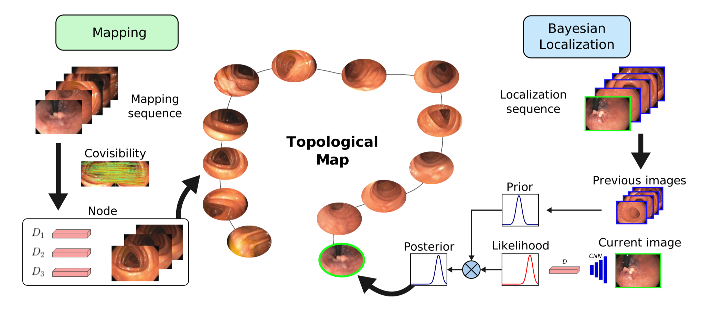

# ColonMapper: topological mapping and localization for colonoscopies

<p align="center">
  <a></a>
</p>

This repository will host the code for our ICRA 2024 paper.

## Related Publication:

Javier Morlana, Juan D. Tardós and J.M.M. Montiel, **ColonMapper: topological mapping and localization for colonoscopies**, *ICRA 2024*. [PDF](https://arxiv.org/pdf/2305.05546)
```
@article{morlana2023colonmapper,
  title={ColonMapper: topological mapping and localization for colonoscopy},
  author={Morlana, Javier and Tard{\'o}s, Juan D and Montiel, JMM},
  journal={arXiv preprint arXiv:2305.05546},
  year={2023}
}
```


